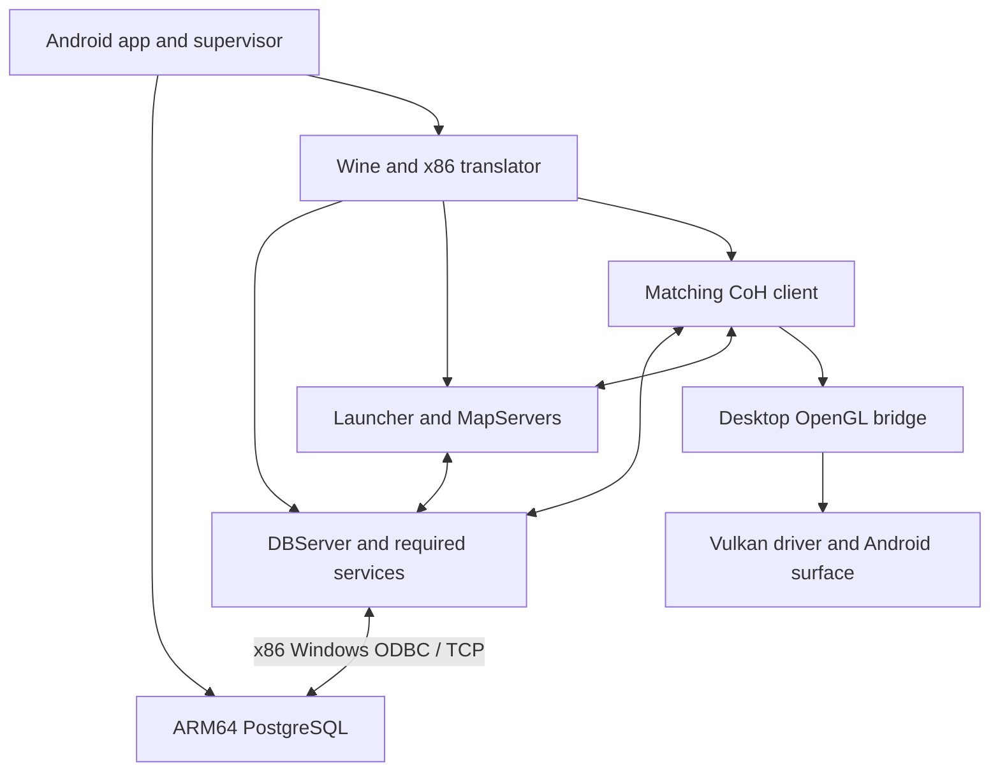

# City of Heroes Android: assessment and implementation proposal

Initial assessment: 2026-09-23. Active baseline restored and validation updated:
2026-09-24. Target: AYN Thor Max, Android 13, Snapdragon 8 Gen 2,
Adreno 740, 16 GB RAM. Scope: an app that can ultimately run both a local
City of Heroes server and its matching client, without a separate Termux install,
root, external SQL Server, or an always-on PC after setup.

**User constraint:** no Windows PC is available, including during setup. Windows
build/reference work must run on GitHub-hosted Windows runners; user-facing
installation and gameplay testing must be possible on the AYN Thor. No purchase
of cloud compute is assumed. [GitHub-hosted runners](https://docs.github.com/en/actions/concepts/runners/github-hosted-runners).

## Updated local server/client validation

The user returned to this original snapshot on 2026-09-24. Its server and graphical
client source built successfully in upstream CI at the exact imported commit;
nine utility/archive/codec tests passed. This is upstream evidence, not our own
runtime test. Matching game assets, database setup, generated content and Android
execution remain unvalidated. The [completeness audit](LOCAL_SERVER_CLIENT_COMPLETENESS.md)
records the evidence and companion-script gaps, including `Game.exe` versus
`CityOfHeroes.exe`, an older default release and configs fetched from moving
`master`. Address these in M0. The i25 acquisition investigation is deferred.

## Recommendation and evidence boundary

Proceed with a **compatibility runtime first**, using native ARM64 PostgreSQL
for persistence and modified Windows x86 CoH processes under an app-owned Wine
runtime. Evaluate FEX as the first translator candidate, then integrate the client
through a tested desktop OpenGL path. Treat native ARM64 server/client conversion
as a later, larger project.

This recommendation is an engineering judgment based on the imported code. It
does not establish that CoH works under FEX/Wine, that its PostgreSQL backend is
correct, or that the combined workload fits the Thor's memory/thermal envelope.
These are explicit acceptance gates below. A source import is complete; a playable
Android build has not been produced or tested.

The inspected baseline is a complete 5,995-file snapshot of an OuroDev-derived
public fork, not a verified current canonical OuroDev checkout. See
[provenance](SOURCE_PROVENANCE.md). This supersedes the *source assumptions* of
the September 13 plan: the baseline is now Issue 24/Volume 2 lineage, the main
targets are demonstrably Win32-only, and client integration is included in the
end goal. Existing game rules, powers and content should stay unchanged while
platform compatibility is established.

## What the source audit establishes

Paths below are relative to [the imported tree](../upstream/ouroboros).

| Finding | Source evidence | Consequence |
| --- | --- | --- |
| Main products require MSVC and 32-bit Windows | `CMakeLists.txt`; `cmake/CoXTargets.cmake` (`COX_MSVC_WIN32`) | An NDK toolchain switch cannot build the game. The MinGW preset does not enable the main products. |
| A host code generator has a portable build path | `Utilities/StructParser/CMakeLists.txt` | Build tools can be separated from target binaries during a later cross-port. This was inspected, not compiled here. |
| Windows-only physics is an active dependency | `MapServer/CMakeLists.txt`, `Common/NovodeX/NwWrapper.h`, `cmake/dependencies/PhysX.cmake` | MapServer links PhysX Loader/Cooking; bundled SDK/runtime files target Win32. Native conversion requires compatible physics replacement/port work. |
| The client uses desktop OpenGL and Cg | `Game/CMakeLists.txt`; `Game/src/render/thread/rt_cgfx.c`; `rt_pbuffer.c` | Validate WGL, OpenGL extensions and Cg profiles. DXVK is not the primary renderer solution for this source. |
| Windows audio and input are present | `Game/src/sound/sound_sys.c`, `Game/src/win/input.c` | Wine must bridge DirectSound/DirectInput, or native backends must be implemented later. |
| PostgreSQL selection and SQL generation exist | `Common/dbserver/servercfg.c`; `DBServer/src/container_sql.c`; `container_tplt_utils.c` | Repair an existing backend before designing a new database layer. |
| PostgreSQL is not currently the supported shipped configuration | `data/server/db/servers.cfg` | Default setup uses SQL Server LocalDB/ODBC 17; changing the provider alone is insufficient. |
| A concrete PostgreSQL defect remains | `DBServer/src/container_sql.c`, `sqlRemoveIndexAsync` | The PostgreSQL branch emits `DROP INDEX ... ON dbo...`; repair and exercise the DDL lifecycle. |
| Other services have independent SQL dependencies | `AccountServer/src/AccountSql.cpp`, `ChatServer/src/ChatSql.cpp`, `AuctionServer/src/AuctionSql.cpp`, `AuthServer/src` | Character persistence success does not prove accounts, login, mail or auctions work. |
| Shared memory and process APIs assume Windows semantics | `libs/UtilitiesLib/src/components/SharedMemory.c`; `libs/UtilitiesLib/src/utils/sysutil.c`; `Launcher/src` | Verify fixed-address mapping, named locks, children and cleanup under Wine. Native ports must preserve these contracts. |
| A minimal local test is documented | upstream `README.md`; `Utilities/TestClient/src/main.c` | Fake-auth DBServer + one MapServer + client is a useful first smoke test, not proof of a complete shard. |
| Source and game data are separate | companion [i24 README](https://github.com/Thunderspies/i24/blob/d51533ec8e6a9cf726b9214968077a05fdcf19f3/README.md) | Acquire matching assets, generate database templates and bins, and hash the resulting runtime package. |

The PostgreSQL syntax conclusion is checked against its [DROP INDEX reference](https://www.postgresql.org/docs/current/sql-dropindex.html).
The remainder of the matrix is grounded in files imported at the locked commit.

## Proposed runtime structure

This is a proposed process/graphics arrangement, not a currently implemented
pipeline. Headless TestClient automation isolates server faults first. Bring
forward a Thor client-runtime probe for graphical/gameplay tests; a desktop
client is optional and must not be a user prerequisite. The final app can have
both server-only and integrated-client modes.

### Architecture choices

| Route | Assessment | Decision |
| --- | --- | --- |
| Windows x86 game processes + ARM64 PostgreSQL | Preserves Win32 physics and game behavior while isolating database/platform changes | Preferred first route, subject to runtime and database tests |
| Fully native ARM64 server immediately | Requires Win32 abstraction, 32/64-bit data audit, physics work and build-system changes together | Defer until a working reference exists |
| Fully native ARM64 client immediately | Adds renderer, shaders, audio, input and asset-cache compatibility to server risks | Separate long-term program |
| SQL Server on Android | No supported native ARM64 product route; emulation introduces another heavy unproven subsystem | Reference/diagnostic environment only |
| SQLite or MariaDB backend | Requires a new persistence adaptation despite existing PostgreSQL code | Revisit only if PostgreSQL proves unsuitable |
| Remote SQL Server or remote gameplay | Useful diagnostic comparisons | Does not meet the offline self-contained goal |

Microsoft documents SQL Server Linux as x64-only and does not support its container
images under emulation/translation. This is a support/platform constraint, not a
claim that all emulation is technically impossible.
[Microsoft requirements](https://learn.microsoft.com/en-us/sql/linux/install-upgrade/setup?view=sql-server-ver17).

## Database and service work

### First persistence target

Preserve the ODBC interface initially. Use an **x86 Windows psqlODBC driver**
inside the same Wine environment as the x86 DBServer, talking over loopback TCP
to ARM64 PostgreSQL. An ARM64 Android driver cannot be loaded into a Windows x86
process. The driver/runtime combination needs its own tiny connection/transaction
test before game debugging. [psqlODBC](https://odbc.postgresql.org/).

Audit `Common/sql/sqlconn.c`, `sqltask.cpp`, DBServer's SQL FIFO, container SQL and
type mappings together. Work includes:

1. Schema creation/evolution: database initialization, `dbo` search path, table
   and identifier casing, constraints, indexes, sequences and explicit IDs.
2. Provider-specific statements and ODBC attributes: isolate SQL Server-only
   behavior, result sets, bound lengths, batching, reconnects and errors.
3. Data round trips: NULL, empty strings, Unicode, timestamps, large text/binary
   container payloads and the existing escaping/serialization conventions.
4. Correct queued-write ordering, transaction rollback, shutdown flushing and
   restart recovery. Validate schema changes against copied databases before
   making them part of an automatic update.
5. Character creation/deletion, costume/powers, inventory, XP/influence, mission
   state and zone transfer, checked through game operations as well as SQL reads.

PostgreSQL should be rebuilt for the app's paths and runtime model. The
[Termux build recipe](https://github.com/termux/termux-packages/blob/master/packages/postgresql/build.sh)
demonstrates Android-specific shared-memory and semaphore work, including unnamed
POSIX semaphores. It is useful precedent, not a drop-in binary for another app.
Pin PostgreSQL and psqlODBC versions only after their compatibility tests pass.

### Service scope

| Component | Initial treatment | Required proof before broader support |
| --- | --- | --- |
| DBServer | Required | Correct schema and durable character state without MSSQL |
| MapServer | Required | Combat, NPCs, normal missions, transfers, saves |
| Launcher | Needed for managed map lifecycle beyond the fixed-map test | Start destination before handoff, unload empty maps, recover crashes |
| AuthServer | Use isolated fake-auth for the first diagnostic profile | Stable identities; later port auth SQL or implement a compatible local account path |
| AccountServer | Evaluate actual dependency of selected gameplay/profile | Character slots, entitlements and inventory must remain correct; port procedures/transactions where required |
| ChatServer | Feature-gated after minimal play | Global chat, mail and user/channel persistence |
| AuctionServer | Feature-gated after minimal play | Transaction and item/currency consistency, including restart |
| MissionServer | Later unless selected features require it | Mission Architect data and persistence; ordinary mission instances still belong in the first playable target |
| Stat/Raid/Arena/Turnstile/Queue services | Audit before disabling each | Supergroup/base, statistics, arena and matchmaking behavior for the declared feature set |
| Monitoring/development tools | Keep source; exclude from mobile runtime by default | Enable only when needed for diagnostics or content preparation |

The imported fake-auth config grants high developer access and accepts arbitrary
login credentials. It is a diagnostic configuration, not a production user profile.
Generate separate loopback-only settings. Verify actual listening sockets: an
advertised localhost address alone does not prove a listener is bound to localhost.
LAN mode needs deliberate authentication and network configuration later.

The account code uses SQL Server-style MERGE/procedure operations and shared SQL
support exposes table-valued parameter types. Do not assume adding a PostgreSQL
connection string ports these services. Explicit local entitlements may simplify
the solo profile, but only after confirming the chosen client/gameplay does not
silently require AccountServer responses.

## Windows runtime, graphics and controller work

### Wine and CPU translation

First test an app-owned Wine/FEX environment that can execute the actual Win32
processes and all their DLLs. FEX supports x86/x86-64 Linux userspace and documents
Wine usage, which makes it a candidate rather than a proven Android CoH solution.
Its Linux/rootfs and Android integration requirements must be pinned and packaged
explicitly. [FEX project](https://fex-emu.com/).

Use prior Thor launcher experience as a starting point for packaging and diagnostics,
but do not assume another game's runtime configuration transfers unchanged. No code
from those apps was inspected or copied in this assessment. If FEX cannot satisfy
the Win32 process/ODBC/graphics tests, compare a verified Wine WoW64/Box64-compatible
path; ordinary Box64 configuration alone is not proof of x86 execution support.

Test process creation, DLL search paths, Windows registry/config paths, locale,
sockets, monotonic timing, thread waits, IO completion, exception handling and
shutdown. Shared memory requires special attention: fixed-address mappings and
pointer-containing structures may constrain the x86 address space. Measure per-map
memory and address-space failures as well as total RAM. Disabling shared memory is
a useful diagnostic switch, but may multiply memory usage across MapServers.

### Client rendering

The audited client links `opengl32`, `glu32`, Cg/CgGL, PhysX, DirectInput and
DirectSound. A promising experiment is desktop OpenGL through Wine and Mesa Zink
to Vulkan/Turnip on Adreno, with a native Android presentation surface. Zink maps
OpenGL over Vulkan; its driver requirements still need validation on this device.
[Mesa Zink documentation](https://docs.mesa3d.org/drivers/zink.html).

Required tests: WGL context/pbuffer creation; required OpenGL extensions and Cg
shader profiles; character creator; skinning, textures, world geometry, shadows,
water and power effects. Record the actual GL/Vulkan device and renderer strings
so software rendering cannot be mistaken for hardware acceleration. Start with a
modest resolution/graphics preset and then measure frame times. No FPS estimate is
credible before these tests.

Cg is a separate compatibility risk even if OpenGL initializes successfully.
If legacy shader profiles fail, first identify the failing profile/extension and
test a constrained compatibility mode. A shader conversion/rewrite is a larger
fallback, not an automatic property of Zink. The old PhysX runtime must likewise
work without assuming CUDA/NVIDIA hardware is available on the Thor.

### Input, sound and app presentation

Provide editable controller-to-keyboard/mouse bindings, multiple action layers,
dead zones/sensitivity, relative mouse capture/recentering, click/drag behavior,
hold/toggle options, an on-screen keyboard and text entry. Keep mappings profile
specific; test flying, vertical movement, targeting and power trays. Handle focus
loss and controller disconnect by releasing held keys/buttons. Start with one
game surface; secondary-screen controls on the Thor can follow basic playability.

Validate DirectSound mixing through the selected runtime's Android audio path,
device changes, buffer underruns, long sessions and background/foreground transitions.
Tune buffering only after measuring underruns and latency. Pause or release render
resources appropriately when the client is hidden while keeping the server's
chosen lifecycle separate.

## Android application and content requirements

The shell should offer Server, Client, Content/Profiles, Controller, Logs and
Backup/Restore areas. A user-started supervisor owns state transitions such as
Preparing, Starting, Ready, Stopping and Failed, with per-process health and clear
recovery actions. A running process alone does not mean the server is ready.

Required platform work:

- Package ARM64 native runtime components using an executable/loading layout that
  works with the intended target SDK. Android restricts executing files directly
  from writable app home for apps targeting API 29+. Prove this before relying on
  extracted ELF programs. [Android execution restrictions](https://developer.android.com/about/versions/10/behavior-changes-10#execute-permission).
- Use a visible foreground-service notification for user-started server sessions,
  with the correct permissions/type on applicable Android versions. Evaluate the
  actual long-running server use case rather than assuming an unlimited data-sync
  service. Test backgrounding, screen lock, process death and low-memory recovery.
  [Foreground service types](https://developer.android.com/develop/background-work/services/fgs/service-types).
- Keep databases and writable runtime state on app-private internal storage.
  Import large content via Android's document picker/SAF; measure whether optional
  external-SD storage can support archive reads adequately. Do not put PostgreSQL's
  live data directory on a generic SAF provider.
- Validate archive paths, symlinks, file counts, declared/unpacked sizes, available
  space and hashes; stage imports and promote only complete profiles. Detect
  Windows filename-case assumptions on Android's case-sensitive filesystem.
- Track a package manifest: source commit, build toolchain, executable/DLL hashes,
  content and bin hashes, schema/template revision, runtime/driver versions and
  expected profile format. Reject incompatible combinations with an actionable
  explanation and preserve the previous working profile.
- Keep logs bounded and export one support archive with sanitized configs, runtime
  versions, process exits, renderer information and recent service logs. Redact
  passwords/tokens and avoid exporting populated databases as routine support logs.
- For broader Android support, test page-size assumptions and package alignment
  explicitly; the Thor test does not establish compatibility with 16 KB devices.
  [Android page-size guidance](https://developer.android.com/guide/practices/page-sizes).

### Content and build supply

The imported source has only three files in its `data` subtree. The companion
text-data repo is a separate pinned candidate; it does not contain all large
binary game assets. Its scripts describe how to obtain additional content. The
first implementation task must inventory actual downloads and hashes rather than
blindly fetching a moving latest release.

Generate database templates with the matched MapServer and regenerate bins with
the matching tools. The companion documentation describes bins as memory-like
caches, so never assume x86-generated bins are interchangeable with future ARM64
layouts. Test archive formats, bin versions, pointer width, alignment and parser
output before allowing native and compatibility profiles to share generated files.

Establish a Windows reference build using the preserved CMake presets, Visual
Studio 2026 and CMake 4.2+ requirements documented by upstream. Preserve exact
toolchain/SDK/dependency versions and verify the runner's availability before
creating destination CI. Offline reproducibility needs a dependency cache with
hashes for all CPM downloads. The existing upstream workflows are reference files
only; they are not active at this repository's root.

Initially compile CoH on GitHub-hosted Windows runners and deliver versioned
runtime packages to Android. In-app compilation is a later feature: this baseline
requires MSVC for the main targets. Downloading source into Android does not
provide that compiler or make the Win32 dependency graph NDK-buildable.

### Saves, migration and updates

Use PostgreSQL logical backups or a properly coordinated physical backup, plus
all non-SQL service files, profile configuration and content/schema identifiers.
Quiesce game writes and drain service queues before a consistent whole-profile
backup. Copying live database files is not a valid default backup method.

Restore into a fresh profile, validate it, then switch profiles. Database major
version changes require their own migration path. Binary/runtime rollback must
not restore an incompatible database schema; preserve a matching pre-update
backup. Existing SQL Server characters require an explicit export/transform/import
process with IDs and gameplay checks; neither an `.mdf` nor a SQL Server backup is
a PostgreSQL import format.

## Stages and acceptance criteria

Effort labels describe uncertainty, not calendar promises. The next authorized
implementation should start with M0; database and Android runtime experiments can
then proceed independently once their common reference is fixed.

| Stage | Deliverable | Acceptance gate | Risk |
| --- | --- | --- | --- |
| M0: reference baseline | Windows source build, pinned companion assets, templates/bins and version manifest | CI builds and headless character/map/persistence checks pass using MSSQL; retain fixtures and complete visual/combat/mission validation on the Thor diagnostic client | Medium; content/toolchain unknowns |
| M1: portable persistence | Repaired PostgreSQL DBServer path and minimum account/auth behavior | Same reference gameplay with SQL Server stopped; CRUD, schema upgrade, rollback, reconnect and crash-recovery checks pass | High; major correctness gate |
| M2: diagnostic Android APK | PostgreSQL, process supervisor, Wine/translator, Win32 ODBC test, logs | On the Thor under app identity: initialize DB, transaction round trip, restart, launch x86 process/DLL, cleanly stop without Termux/root | High; runtime packaging gate |
| M3: Android server | Minimum required services and managed MapServer lifecycle | Headless client checks pass, then the Thor diagnostic client plays locally; ordinary mission transfer and post-restart persistence work; peak memory recorded | High; first playable server |
| M4: integrated client | OpenGL/Cg hardware path, audio, controller, Android surface | Character creator/world/effects render correctly; movement, power trays and text work; local server and client run together | High; graphics/resource gate |
| M5: usable offline app | Guided imports, profiles, version validation, backup/restore, recovery | Fresh install through play without a shell; airplane-mode operation; restore into clean profile; repeated transfers and two-hour session | Medium after research gates |
| M6: broader services | Selected chat/mail, auction, bases, Architect, arena features | Each enabled feature passes gameplay, persistence and multi-service restart consistency tests | Variable |
| M7: native conversion | Incremental ARM64 platform/backend replacements | Behavior matches reference and measured memory/CPU/thermal benefit justifies migration | Very high; long-term |

Add a basic Thor client-runtime probe alongside M2 so M3 gameplay testing does
not depend on a Windows PC. CI TestClient coverage must be audited and expanded
where needed; a headless connection test alone does not establish combat, mission
or graphical correctness. GitHub-hosted CI is not a persistent public game server.

M2 may yield an APK before the game is playable. Name and document such a build as
a diagnostic APK, with narrow test instructions. Do not equate reaching login,
loading one fixed map, or passing a GPU probe with the corresponding playable gates.

### Measurement plan

Start with one shard/player, one starting map and enough capacity for source and
destination maps to overlap during transfers. Use normal lifecycle rules to retire
empty maps. A strict one-MapServer cap can break zoning and mission entry.

Collect startup time, each process's proportional memory, peak transfer memory,
x86 address-space failures, database queue depth, simulation stalls, client median
and tail frame times, audio underruns, temperatures and storage writes. Compare
server-only and combined operation. Establish safe budgets from the device results;
16 GB installed RAM is not a usable app-memory guarantee. Optimize map count and
content/cache loading before adding many graphics toggles or speculative CPU flags.

## Native ARM64 conversion work breakdown

If the compatibility build is viable, retain it as the regression reference while
converting components in this order:

1. Host tools and isolated libraries: CMake host/target split, generated files,
   archives/codecs, serialization fixtures and reproducible assets.
2. Platform abstraction: files/paths, threads, atomics, timers, sockets, process
   lifecycle, registry/config, shared memory and exception/crash reporting.
3. Architecture audit: pointer-to-integer casts, MSVC `long` assumptions versus
   LP64, struct packing, varargs/formatting, x86 assembly/intrinsics and alignment.
   Freeze wire formats and disk formats; CPU bitness must not change protocols.
4. Native server services: port low-dependency components first, then DBServer and
   MapServer. Resolve legacy PhysX/cooking compatibility and validate navigation,
   collision, powers and map data against the reference before replacing physics.
5. Native client: replace WGL with EGL/platform presentation, legacy OpenGL/Cg
   with a supported shader/render path, DirectInput with Android/controller input,
   DirectSound with a native audio backend, and Windows window/IME integration.
6. Remove the compatibility runtime only when every selected gameplay path and
   backup/restore workflow passes, including long-session and thermal tests.

## Immediate implementation proposal

The highest-value next change is **M0's reproducible Windows reference build and
content manifest**, followed by **M1's PostgreSQL connection/schema harness and
first provider fixes**. In parallel as a separate work package, prepare M2's
native PostgreSQL + Win32 ODBC diagnostic APK. Keep game behavior patches separate
from immutable source import and runtime packaging commits.

The four decisions needing evidence are: a verified source/data pair, PostgreSQL
correctness, Win32/PhysX/shared-memory compatibility on Thor, and OpenGL/Cg client
compatibility. The full app is plausible as a staged engineering project, but
those gates must pass before committing to performance targets or a completion date.
